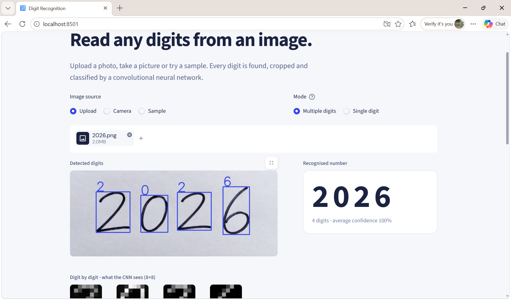

# 🔢 Digit Recognition

A PyTorch convolutional neural network that reads digits (0–9) from images. Upload a photo, use your camera or try a sample, and the app finds **every digit in the image**, classifies each one and shows the confidence.



## How it works

1. Convert the image to **grayscale** and make the ink bright on a dark background (handles light-on-dark too).
2. **Find each digit** with OpenCV contour detection and crop it into a centred square.
3. **Resize to 8 × 8**, the input size the CNN was trained on.
4. The **CNN** outputs 10 scores:

   | Layer | Output |
   |---|---|
   | Conv2d(1→32, 3×3) + ReLU + MaxPool | 32 × 4 × 4 |
   | Conv2d(32→64, 3×3) + ReLU + MaxPool | 64 × 2 × 2 |
   | Flatten → Linear(256→128) + ReLU | 128 |
   | Linear(128→10) | 10 scores |

5. **Softmax** converts scores to probabilities and **argmax** picks the digit.

## Features
- Multi-digit recognition (e.g. `2025`, `7305`) as well as single-digit mode
- Upload, camera or built-in samples
- Annotated image with a box and prediction on every digit
- Per-digit confidence, with low-confidence digits flagged
- Probability chart and top-3 alternatives for any digit
- Unit tests for preprocessing and recognition

## Project structure
```
├── app.py                    # Streamlit app
├── digit_model.py            # CNN definition, loading and prediction
├── preprocess.py             # grayscale, ink detection, digit splitting, 8x8 tiles
├── inferimage.py             # original command-line single-image script
├── model_weights_10class.pth # trained weights (10 classes)
├── samples/, zero.jpeg, two.jpeg
├── tests/
└── requirements.txt
```

## Run it
```bash
pip install -r requirements.txt
python -m streamlit run app.py     # opens http://localhost:8501
python -m pytest                   # run tests
python inferimage.py               # classify two.jpeg from the command line
```

## Limitations
The network is deliberately small (8 × 8 input). It works best on clear printed or neatly written digits on a plain background. Messy handwriting and touching digits can be misread, and 6, 8 and 9 are the most commonly confused, so the app flags low-confidence results. In my own test of all ten digits across five different fonts, 39 of 50 were read correctly. Possible next steps: train on a larger dataset such as MNIST with 28 × 28 inputs, add data augmentation, and add a drawing canvas.

## Author
**Anto Jovita** · B.Tech Artificial Intelligence & Data Science
